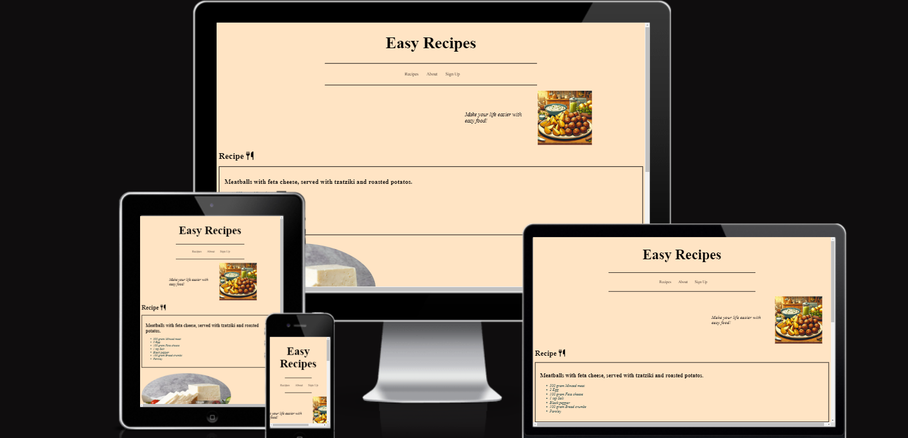

# Welcome to Easy Recipes!

# Introduction
Are you looking for a quick, delicious meal that's sure to please the whole family? Look no further! Our site is dedicated to providing you with easy-to-follow recipes that are both tasty and satisfying. Today, we're thrilled to share with you one of our all-time favorites: homemade meatballs.

Our easy meatball recipe is perfect for busy weeknights when you want to whip up something hearty and comforting without spending hours in the kitchen. With simple ingredients and straightforward instructions, you'll have juicy, flavorful meatballs ready to serve in no time.

Whether you're a seasoned home cook or just starting out on your culinary journey, our recipe is sure to become a staple in your kitchen. So grab your apron and let's get cooking!

### Features:
HTML and CSS Setup: The project includes a well-structured HTML layout with accompanying CSS styling, ensuring a visually appealing and intuitive user experience.

### Social Network Integration:
 Stay connected! We've added links to popular social networks, allowing users to share their favorite recipes with friends and family.

### Sign Up Page: 
Join our community! Users can sign up for a personalized account, unlocking additional features such as saving favorite recipes and receiving updates on new content.

## Content
**Table of Content:**
* [Introduction](#introduction)
* [Vision](#vision)
    * [My vision](#my-vision)
* [User stories](#user-stories)
    * [First Time Visitor Goals](#first-time-visitor-goals)
    * [Returning Visitor Goals](#returning-visitor-goals)
    * [Frequent User Goals](#frequent-user-goals)

## Vision:

### My vision about the Project and 'Easyrecipes'
I wanted to make a simple and easy website, with easy recipes that everyone can do with simple knowledge. my vision was to keep it easy to navigate and easy to find what you want on the page.
In the future you can add categoris on the website to make it to a bigger portal for more people.
Maybe even video-tutorials and gallery with picture of my food and the readers food.

### User stories:

#### First Time Visitor Goals

As a First Time Visitor: *I want to easily understand the main purpose of the site and learn more about easy recipies.*
As a First Time Visitor: *I want to be able to easily navigate throughout the site to find content.*
As a First Time Visitor: *I want to see the food and what you can do with it. I also want to locate their social media links to see their followings on social media and if they are posting any news there.*

#### Returning Visitor Goals
As a Returning Visitor: *I want to see more recipies and learn more.*
As a Returning Visitor: *I want to sign up so I can get all the news.*
As a Returning Visitor: *I want to find community links.*

#### Frequent User Goals
As a Frequent User: *I want to check if there is any new recipies (categoris in the making for future)*
As a Frequent User: *I want to see more picture, maybe readers own pictures (gallery may be added)*
As a Frequent User: *I want to come back for new posted recipies every week*

## Navbar:
Recipe, About and Sign up.

I have choosen to have a white/grey hover on my navbar-links, just to have a contrast.

**Recipe**- *First page with one simple recipe for a healthy meal.*
**About**- *About the owner of the website and her vision about the website.*
**sign up**- *sign up for more recipies.*

**Footer** - here is the Social media-links: Facebook, Instagram, Twitter and Youtube.
 
 Here i have choose to have the same theme as in the navbar. first I had written the text for each link (facebook, twitter, etc) but then I think the icons where better.

### Future Features:
1. add more recipies on website, even categoris for different proteins and ingredients.
2. people who signed up will get weekly updates with new recipies and can also send in pictures and their own recipes that can be added to the website
3. open up a gallery with pictures of the food.
4. add videos and video-tutorials how to cook.

## Am I responsive?

## Here is my wireframe for the project:

## Manual Testing/Function

| Feature | Action | Effect 
|--|--|--| 
|navbar links|Click on Recipes| Open home|
|--|          Click on About | Open About|
|--|          Click on sign up | Open sign up|
| Sign up-page|Fill out the form and submit| form dump is showing up, formel is ok|
| Sign up-page| Try to submit without writing email-adress|warning about empty field pop up's|
|Social media | Trying to click on Facebook-icon|Facebook's startpage is showing|

## Testing:

trying in W3-validator ( HTML ):
| page | error | solution | Fixed and Solved |
|--|--|--|--|
| index.html | Error: Element ul not allowed as child of element h4 in this context. (Suppressing further errors from this subtree.) |Deleted < h4 > - element | X |
| about.html | No ( li ) element in scope but a ( li ) end tag seen, from line 24 - > 26 | Deleted this | X |
| about.html | Stray end tag < a > in line 29 | Deleted this | X |
| about.html | Start tag body seen but an element of the same type was already open, line 31 | Deleted this and did only use the first one. | X |
| about.html | Stray start tag footer. | added both body and html-element that have been missed. | X |
| signup.html | Section lacks heading. Consider using h2-h6 elements to add identifying headings to all sections, or else use a div element instead for any cases where no heading is needed. in line 34 | changed Section-element to Div-element instead | X |
| signup.html | Saw end of file without the previous tag ending with >. Ignoring tag. | Added > | X |
| signup.html | The value of the for attribute of the label element must be the ID of a non-hidden form control. in line 44. | changed it from "email-address" to "email_address" | X |

testing in W3-validator ( CSS ):

Testing in browser:
I have been testing in: Mozilla Firefox, Microsoft Edge and Safari. I also Tried it on my mobilephone (iphone, safari)

## Credit:
I have used Google image for search after photos. 
*happy family* : https://alba-inc.org/the-family/
*feta cheese* : https://www.istockphoto.com/se/foto/ripe-white-cheese-feta-cheese-made-from-cows-milk-on-a-wooden-serving-board-dairy-gm1466606703-498572346
*food plate* : made by https://chat.openai.com

for my coding I have used 'Love running' and Youtube for inspiration, and w3Schools.com If I had any issues. 
*youtube*: https://youtu.be/Q5m8cCGdiBo?si=qxC771tXKXOgXVI8 , https://youtu.be/K24lUqcT0Ms?si=XEdWrw4J94KM3Ln_
The Icons are taken from Fontawesome 'https://fontawesome.com/?utm_source=v4_homepage&utm_medium=display&utm_campaign=fa5_released&utm_content=banner'

I have also got help from Slack-community ' https://app.slack.com/client/T0L30B202/C0267LTSCNB'

[def]: #first-time